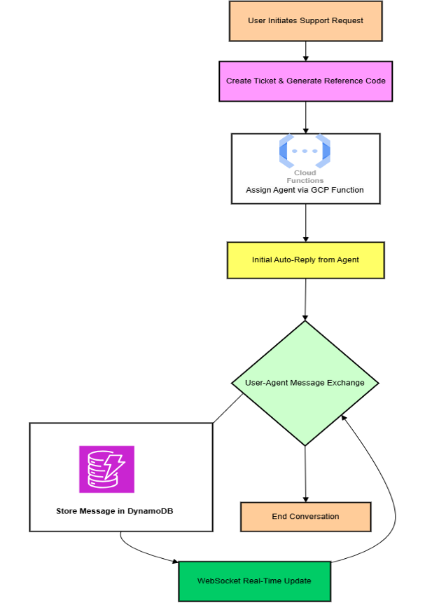

# QdpDataProcessor
## Overview
This project focuses on developing a secure, scalable, and efficient serverless architecture for user authentication and real-time message passing chatbot type support using AWS and GCP services. It is based on architecture built using multi-cloud integration of AWS and GCP serverless solutions. The React.js is used as Frontend to provide the sealess user interaction. 

## The outcome of this project are:- 
- a strong learning on how to setup the complete authentication flow using cloud provider without managing any infrastructure usign just managed services
- setting up a synchonous ticketing system for user support that is fully scalable with the serverless offering, distributed between AWS and GCP cloud.

## 🛠️ Modules
### 1. User Management & Authentication

Purpose: Securely manage user registration, authentication, and authorization.

Key Features

User Registration: AWS Cognito stores user details securely.

Multi-Factor Authentication (MFA): Includes security questions and math-based validation.

Token-Based Authentication: Uses JWT tokens for session management.

- **Technologies Used**: AWS Cognito, AWS Lambda, AWS DynamoDB, GCP Functions

Authentication Flow

- User provides credentials.

- Security question verification.

- Math expression validation.

- If all checks pass, Cognito issues a JWT token.

### 2. Message Passing

Purpose: Enables real-time messaging between users and support agents.

Key Features

Support Ticket Creation: Users generate a reference code for issue tracking.

Real-Time Messaging: Uses AWS WebSocket API and DynamoDB Streams.

Agent Assignment: GCP function assigns available agents.

- **Technologies Used**: AWS DynamoDB, AWS WebSocket API, AWS Lambda, GCP Functions

Message Flow

- User creates a support ticket (stored in DynamoDB).

- GCP function assigns an agent and sends an auto-reply.

- Users and agents exchange messages in real-time using WebSockets.

